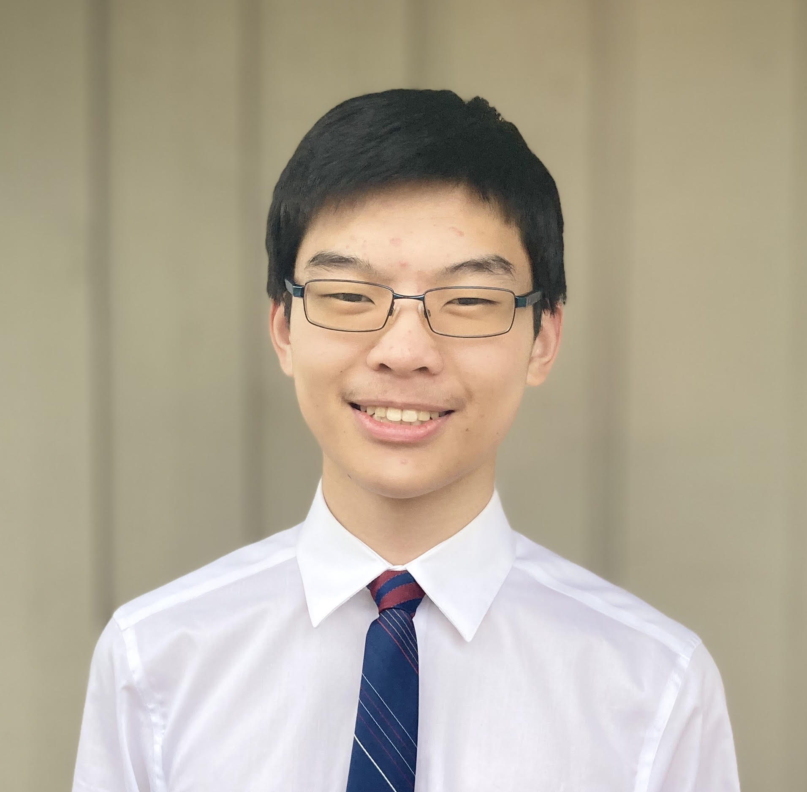

---

layout: home
title: "About"
permalink: /

---

{: width="30%" style="float:left; padding-right:2%; border-radius:50%" }

Hello! I am a software engineer at [Snowflake](https://www.snowflake.com/en/) on the Trust Center Platform team. I help build the platform that allows customers to scan their accounts in Snowflake for security violations and threats.

I graduated with a BS and MS in computer science from the [University of Washington](https://www.washington.edu/). My primary interests lie in computer science systems and education. 

Throughout my coursework and work experiences, I have found an increasing passion in computer science. In particular, I am fascinated by the subfields of computer science theory and systems. I enjoy theory for its problem-solving and logical proof-writing aspects, and my current exploration of distributed systems stems from my fascination with the protocols discussed in the introductory course (CSE 452) at UW. I have really enjoyed systems concepts involving abstraction, fault tolerance, and parallelization.

I have also found that I enjoy teaching computer science as a teaching assistant for the [UW Allen School](https://www.cs.washington.edu/). I have always been fond of learning, and likewise, teaching has been an additionally rewarding experience. I am thrilled by the prospect of not only bolstering my own expertise in the subject, but also supporting students' learning in these captivating subjects.

My current goals lie in software engineering, and ideally in computer systems. I hope to build meaningful solutions while fortifying my technical expertise, applying both systems and algorithmic knowledge into my work. In the long-term, I hope to incorporate teaching into my career, either part-time or eventually full-time as a teaching professor.

See my (infrequently updated) [resume](/assets/resume.pdf){:target="_blank"} for more. Additionally, please feel free to contact me through any of the links below!
